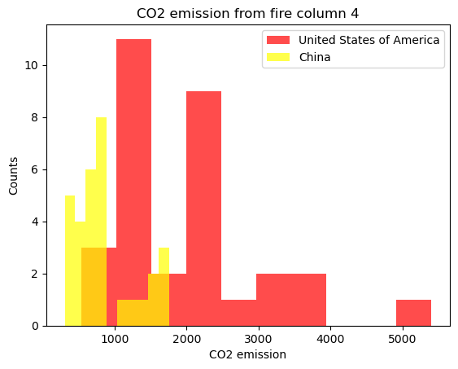

# Assignment 6: Workflows

## About the Project

A program retrieves information of CO2 emission from fire events occurred between 1990 to 2020 in several countries around the world.

### Introduction

In this setting, CO2 emission data reported in China and the United States of America was collected and compared based on the fire sources.

### Results

The CO2 emission record from *Forest Fires* (Figure 1) shows that this incident frequently occurred in the United States of America more than in China during 1990-2020. Meanwhile, a fire event with *Crop Residues* is more common in China than in America (Figure 2). It is interesting to note that *Rice Cultivation* produce a significant amount of CO2 in China more than in the United States almost ten times (Figure 3), and even more than the other two sources mentioned before.

* **Figure 1**: A histogram shows CO2 emission from Forest Fires in China and the United States of America.
   

* **Figure 2**: A histogram shows CO2 emission from Crop Residues in China and the United States of America.
   

* **Figure 3**: A histogram shows CO2 emission from Rice Cultivation in China and the United States of America.
   

### Methods

1. The CO2 emission table was downloaded from the classroom google drive [Link](https://drive.google.com/drive/u/3/folders/15dnNnOEjDZDvwzM-_tGGtWjTbNL669i7).

2. CO2 emission data from Forest Fires, Crop Residues and Rice Cultivation in China and the United States of Americ awas extracted and stored in text files corresponding to the values in each coloumn.

3. All stored CO2 emission data files were plotted in a histogram to compare the certain fire events in China and the United States of America.

## Getting started

### Prerequisites

* Install [Conda](https://conda.io/projects/conda/en/latest/user-guide/install/index.html)

* Install python 3.x

### Installation

1. Clone the repository
   ```sh
   git clone https://github.com/cu-swe4s-fall-2023/assignment-2-python-refresher-FahsaiNak.git
   ```

2. Create environment from env.yml
   ```sh
   conda env create -f env.yml
   ```

3. Install [Snakemake](https://snakemake.readthedocs.io/en/stable/)
   ```sh
   conda install -c conda-forge -c bioconda snakemake graphviz
   ```

4. Install [Matplotlib](https://pypi.org/project/matplotlib/)
   ```sh
   python -m pip install -U matplotlib
   ```

### Usage Example
The command runs Snakefile workflow to download CO2 emission data, retrieve data from the specified sources in China and United States of America and plot the data in histogram. All information is from Agrofood_co2_emission.csv
   ```sh
   snakemake -c1
   ```
